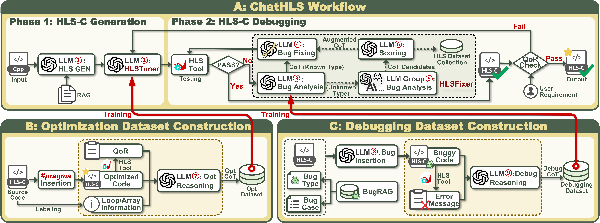

# ChatHLS: Towards Systematic Design Automation and Optimization for High-Level Synthesis
> 🎉 **Accepted by ACL 2026 main conference**

[](https://arxiv.org/abs/2507.00642) [](https://huggingface.co/XXXiong/ChatHLS-HLSFixer) [](https://huggingface.co/XXXiong/ChatHLS-HLSTuner)

ChatHLS is an open-source workflow for transforming a source C/C++ project or natural-language HLS specification into optimized HLS-C through a LLM-driven pipeline:



`transform -> CSIM -> CSYN -> COSIM -> debug on failure -> optimize -> debug on optimization failure`

When the first debug repair still fails validation, ChatHLS escalates to a multi-end debug evaluation path that runs multiple analysis agents, scores their suggestions, and then applies the selected repair.

This repository is the public release for paper *ChatHLS: Towards Systematic Design Automation and Optimization for High-Level Synthesis*.

## Models

The fine-tuned model weights for ChatHLS are available on Hugging Face: [**HLSFixer**](https://huggingface.co/XXXiong/ChatHLS-HLSFixer), [**HLSTuner**](https://huggingface.co/XXXiong/ChatHLS-HLSTuner).

## Configuration

Edit these defaults there before running ChatHLS:

- `DEFAULT_OPENAI_API_KEY`
- `DEFAULT_OPENAI_API_BASE`
- `DEFAULT_VITIS_HLS_PATH`
- `DEFAULT_TRANSFORM_MODEL`
- `DEFAULT_DEBUG_ANALYSIS_MODEL`
- `DEFAULT_DEBUG_MODIFY_MODEL`
- `DEFAULT_OPTIMIZE_ANALYSIS_MODEL`
- `DEFAULT_OPTIMIZE_MODIFY_MODEL`

## Quickstart

Install dependencies first:

```bash
pip install -r requirements.txt
```

**Note**: By default, ChatHLS uses `DEFAULT_TRANSFORM_MODEL` for the debug/optimize analysis steps as well. To switch those analysis steps to the fine-tuned ChatHLS models (`HLSFixer` and `HLSTuner`), add `--analysis-backend hf` to any of the commands below.

Run the workflow on a C/C++ project:

```bash
run_chathls.sh \
  --repo-root . \
  --project-dir examples/projects/vector_mul \
  --kernel-name vector_mul \
  --top-function vector_mul \
  --source-file vector_mul.cpp
```

Run the workflow from a natural-language specification:

```bash
run_chathls.sh \
  --repo-root . \
  --spec-file examples/specs/wire_assign.md \
  --template-dir examples/projects/wire_assign \
  --kernel-name wire_assign \
  --top-function wire_assign \
  --source-file wire_assign.cpp
```

On Windows, run the batch wrapper instead:

```bat
run_chathls.bat --repo-root . --project-dir examples/projects/vector_mul --kernel-name vector_mul --top-function vector_mul --source-file vector_mul.cpp
```

## CLI Commands

- `chathls workflow`
- `chathls transform`
- `chathls run-hls`
- `chathls debug`
- `chathls optimize`

## Outputs

Each workflow run creates a timestamped directory under `runs/` with:

- `summary.json`: top-level run summary, including validation/optimization counts, pass/fail status, and the final latency/resource report.
- `artifacts/`: stage artifacts such as validation/debug results, and per-round optimization decisions plus generated candidate source files.
- `project/`: a working project used for the run, including the current HLS source/testbench, `run_hls.tcl`, and `logs/compilation_log.txt`.

## Requirements

See [Requirements](requirements.md) for the full software setup.

## Workflow

See [Workflow](workflow.md) for the execution flow and artifact layout.

## License

This repository is released under the Apache License 2.0. See [LICENSE](LICENSE).
